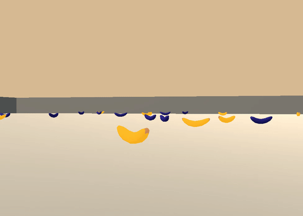
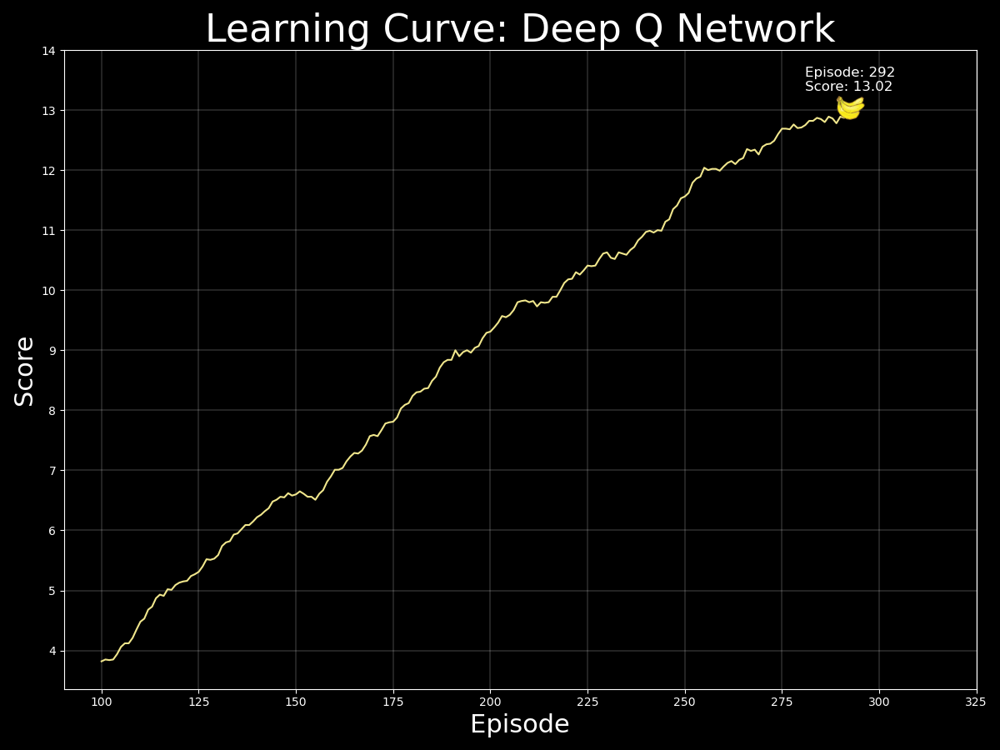
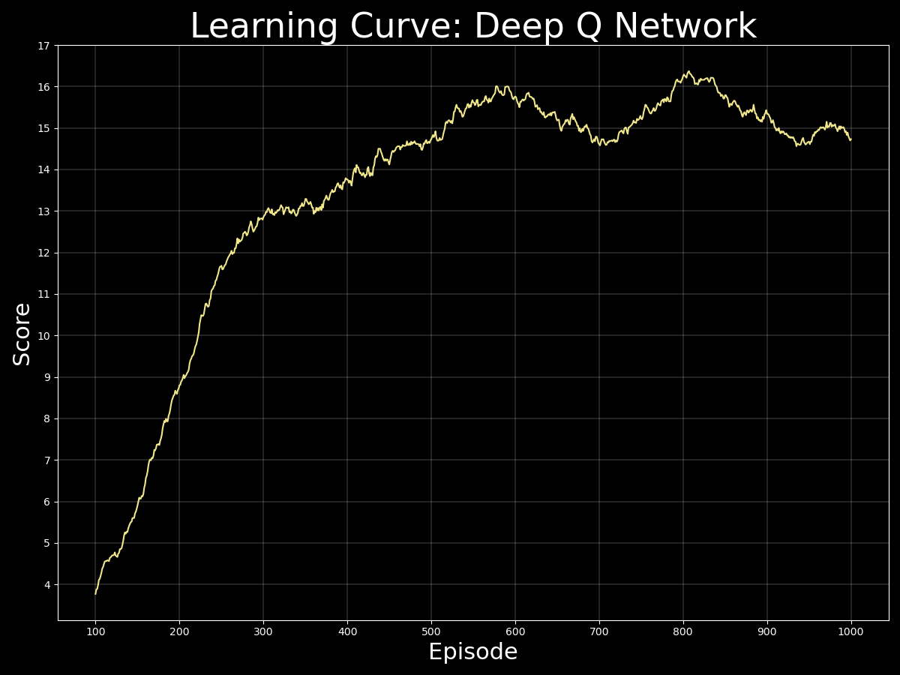
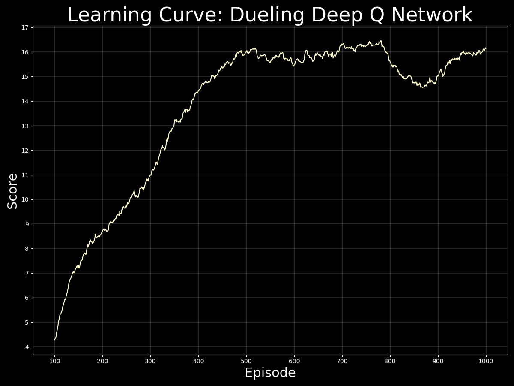

# Deep Q Networks: Utilizing Deep Reinforcement Learning to Train Agents on Specified Tasks
Deep Reinforcement Learning is among the most promising breakthroughs when it comes to the future of deep learning and realizing *actual* artificial intelligence.  While more primitive algorithms may be used for simple prediction tasks, Reinforcement Learning algorithms such as Deep Q Networks enable scientists to train an agent on tasks through experience in predefined ecosystems.  This concept is very similar to the way humans are able to learn from their environment.  Through real-world experiences, humans are able to evaluate cues of encouragement or dissuasion from sensory information in order to build on their ideas on how to interact with the world around them.  Deliberate mathematical equations, theory and deep learning combine to enable this learning technique in artificial reality.

## Details
Utilizing a predefined environment, the above code initializes and trains an agent to perform a specific task through the use of positive and negative feedback.  Traversing a large square world, the agent selects actions based, in part, on optimizing its performance utilizing stored information on past experiences.

For this task, the agent is challenged with collecting as many `yellow` bananas as possible while avoiding `blue` bananas.  Each yellow banana collected results in a score increase of `+1` while each blue banana results in a decrease of `-1`.  The environment is considered solved once an average score of `13` is achieved over 100 episodes, each consisting of 1000 timesteps.

The agent is able to choose from `4` discrete actions at each timestep: *forward*, *backward*, *left* or *right*.  Actions are selected either randomly (to allow the agent to explore alternative policies) or via predictions based on the agent's current state.  State information includes `37` continuous values that provide ray-based perception data of objects that lay in the forward direction.  These states are used as inputs of either Deep Q Networks or Dueling Deep Q Networks which are initialized and updated frequently based on past experiences and their respective outcomes in order to optimize the agent's behavior over time.

 

  

## Results
In the `saved_files` directory, you may find the saved model weights and learning curve plot for the most succesful agent.  This agent, which you can see operating in the GIF above, was able to solve the environment within 292 episodes utilizing a Deep Q Network algorithm for action predictions.  A local and target network were utilized in order to stabilize the training process.  The graph below depicts the agent's performance over time in terms of relative score averaged over the past 100 episodes.

 

  

 
 

Although the Deep Q Network surprisingly outperformed the Dueling Deep Q Network implementation en route to a score of 13, the Dueling Deep Q Network improved performance at a much faster pace as the score was surpassed and its training remained more stable.  A score above 16 was achieved within 500 episodes by the Dueling Deep Q Network, while it took almost 600 episodes for the Deep Q Network to accomplish this same feat.  Below you may see the learning curves for both Q Network implemenations to compare their performances over time.

 

  

 

  

## Dependencies
In order to run the above code, you will have to set up and activate a customized Python 3.6 environment.  Please follow the directions [here](https://github.com/udacity/deep-reinforcement-learning#dependencies) for setup instructions.

Next, please click the link corresponding to your operating system below which will download the respective UnityEnvironment.  You may then save the resulting file directly inside of your cloned repository in order to run the code.
* [Linux](https://s3-us-west-1.amazonaws.com/udacity-drlnd/P1/Banana/Banana_Linux.zip)
* [Mac OSX](https://s3-us-west-1.amazonaws.com/udacity-drlnd/P1/Banana/Banana.app.zip)
* [Windows (64-bit)](https://s3-us-west-1.amazonaws.com/udacity-drlnd/P1/Banana/Banana_Windows_x86_64.zip)

## Train an Agent
All of the relevant functionality and tools you will need to create and train your agent are available in this repository.  Please use the `train_agent.py` file in order to run the training process.  If you would like to change any parameters to customize your agent or trainer, please update the relevant attributes in the function calls below the `if __name__ == '__main__':` block.
